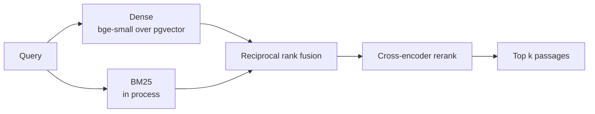

# Research Copilot

Retrieval over arXiv `quant-ph`, built so an answer can point at the paragraph it
came from. This repository covers the corpus and the retrieval stack; the
synthesis layer is not in it yet.


## Corpus

Papers are read from the arXiv Atom API and ingested from their LaTeX source
rather than from the rendered PDF. A two-column preprint loses in layout exactly
what a citation needs: section headings become indistinguishable from body text,
and paragraphs fragment around displayed equations. Measured on the first three
papers, PDF extraction recovered one section per paper, the title; the LaTeX
source recovers the real hierarchy.

| | |
|---|---:|
| Papers ingested | 249 |
| Chunks | 19,560 |
| Chunks per paper | 78.6 |
| Mean chunk length | 522 characters |
| Distinct sections | 2,875 |

Of 300 papers attempted, 51 were dropped: 41 whose source the LaTeX renderer
could not process, the rest without retrievable source. That is 17% of the
category, and it is a property of the source rather than of the pipeline.

## Provenance

A citation names a paper, a paragraph and the piece within it, so that triple
carries a unique constraint in the schema. The arXiv identifier keeps its
version suffix: a revised paper is a distinct row rather than a silent
overwrite of the text a stored citation points at.

Long paragraphs are split on sentence boundaries with one sentence of overlap,
and every piece keeps the index of the paragraph it came from, so splitting
never costs the citation its anchor.

## Retrieval

Four stages, each replaceable and each measured separately.



Fusion combines ranks rather than scores. A BM25 score and a cosine similarity
live on scales that are not comparable and neither is calibrated, so weighting
them directly would require normalising a quantity with no fixed range.

BM25 is built in process from the stored chunks rather than in the database.
Postgres full text search ranks with `ts_rank`, which is not BM25, and the
evaluation below is only comparable to published numbers if the scoring
function is the one those numbers used. At corpus scale this is the component
that would move into the database first.

## Evaluation

### BEIR SciFact

The judgements in a public benchmark are what make the figures comparable. The
dataset stands in for the corpus; the fusion and reranking code is the code the
service runs.

| Retriever | nDCG@10 | Recall@10 | MRR@10 | Rerank ms |
|---|---:|---:|---:|---:|
| `bm25` | 0.652 | 0.776 | 0.618 | 0 |
| `dense` | **0.713** | 0.836 | **0.682** | 0 |
| `hybrid` | 0.709 | 0.838 | 0.675 | 0 |
| `hybrid+rerank` | 0.703 | **0.846** | 0.667 | 2482 |

BM25 at 0.652 and `bge-small-en-v1.5` at 0.713 sit where the published SciFact
figures for those methods sit, which is the check that the implementation is
correct rather than merely self-consistent.

### The ingested corpus

Sixteen hand-written questions, eleven of them anchored to the passage the
question was written from. A result is judged twice: whether the answering paper
appears, and whether that passage does.

| Retriever | Paper found | Passage found | MRR | Latency ms |
|---|---:|---:|---:|---:|
| `bm25` | 1.00 | 0.82 | 0.877 | 118 |
| `dense` | 1.00 | 0.73 | **0.969** | **53** |
| `hybrid` | 1.00 | 0.82 | **1.000** | 147 |
| `hybrid+rerank` | 1.00 | **0.91** | **1.000** | 1788 |

Every retriever finds the answering paper for every question, so the set does not
discriminate at paper level and only the passage column carries information.

### The reranker is not enabled by default

The two evaluations disagree about it, and neither supports switching it on.

On 300 judged SciFact queries the cross-encoder lowers nDCG@10 from 0.709 to
0.703 and MRR from 0.675 to 0.667, gaining 0.008 of recall. Reducing the depth
from 25 to 10 does not recover the loss: nDCG falls further, to 0.699. The model
is trained on web passages and the benchmark is scientific claim verification.

On the corpus questions it moves passage hits from 9 of 11 to 10 of 11. That is
one question, which is not a basis for a decision.

The latency settles it. Reranking 25 candidates takes 2.5 s per query on four
CPU cores. Measured directly over five queries, the median is 3.2 s for
`ms-marco-MiniLM-L-6-v2` and 19.1 s for the larger `bge-reranker-base`, so a
stronger cross-encoder is further outside any serving budget rather than closer
to one.

`hybrid` is what the service uses. The reranking stage stays in the code behind a
flag, since the finding is a property of this corpus, this hardware and these
two models rather than of reranking in general.

Reproduce with:

```bash
python -m evaluation.benchmark      # BEIR SciFact
python -m evaluation.corpus         # the hand-written question set
```

## Running it

```bash
docker compose up -d
python -m venv venv && source venv/bin/activate
pip install -r requirements.txt

alembic upgrade head
python -m ingest.pipeline --limit 300
```

Ingestion takes roughly 50 minutes for 300 papers, most of it the three-second
delay arXiv asks between requests. A run is resumable: papers already stored are
skipped, and downloaded sources are cached on disk.

## Development

```bash
pip install -r requirements-dev.txt

pytest              # 26 tests
ruff check .
```

No test reaches the network or the database. CI additionally applies the
migration against a `pgvector` service container, since the schema declares a
vector column that a plain Postgres image cannot create.

## Project structure

```text
Research-Copilot/
├── ingest/
│   ├── config.py         # Corpus, model and connection settings
│   ├── arxiv.py          # Atom API client
│   ├── source.py         # LaTeX source download and flattening
│   ├── extract.py        # Source to paragraphs with their section
│   ├── chunk.py          # Paragraphs to embeddable pieces
│   ├── embed.py          # Passage and query encoders
│   └── pipeline.py       # End to end ingestion
├── retrieval/
│   ├── config.py         # Candidate depth, fusion and reranking settings
│   ├── dense.py          # Nearest neighbours over pgvector
│   ├── sparse.py         # BM25 over the stored chunks
│   ├── rerank.py         # Cross-encoder rescoring
│   └── hybrid.py         # Rank fusion and the search entry point
├── evaluation/
│   ├── beir.py           # Benchmark loading
│   ├── metrics.py        # nDCG, recall and reciprocal rank
│   ├── benchmark.py      # Public benchmark run
│   └── corpus.py         # Hand-written question set
├── db/                   # SQLAlchemy models and session
├── alembic/              # Migrations
├── data/questions.json   # Question set for the ingested corpus
├── tests/                # pytest suite, offline
└── docker-compose.yml    # Postgres with pgvector
```
