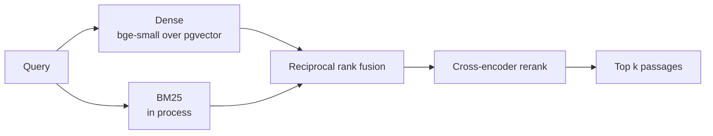

# Research Copilot

Retrieval over the quantum cryptography literature on arXiv, built so an answer
can point at the paragraph it came from. This repository covers the corpus and
the retrieval stack; the synthesis layer is not in it yet.


## Corpus

The corpus is scoped to quantum key distribution and quantum cryptography rather
than to `quant-ph` as a whole. Retrieval across 185,000 papers on unrelated
subjects mostly measures topic separation, since almost any method tells an
optics paper from an error-correction one. Within one field that signal is gone
and what remains measured is passage selection, which is the operation the
system exists to perform.

Papers are read from the arXiv Atom API and ingested from their LaTeX source
rather than from the rendered PDF. A two-column preprint loses in layout exactly
what a citation needs: section headings become indistinguishable from body text,
and paragraphs fragment around displayed equations. Measured on the first three
papers, PDF extraction recovered one section per paper, the title; the LaTeX
source recovers the real hierarchy.

| | |
|---|---:|
| Papers ingested | 240 |
| Chunks | 18,969 |
| Chunks per paper | 79.0 |
| Mean chunk length | 530 characters |
| Distinct sections | 2,952 |

Of 300 papers attempted, 60 were dropped: 47 whose source the LaTeX renderer
could not process, the rest without retrievable source. That is 20% of the
query, and it is a property of the source rather than of the pipeline.

## Provenance

A citation names a paper, a paragraph and the piece within it, so that triple
carries a unique constraint in the schema. The arXiv identifier keeps its
version suffix: a revised paper is a distinct row rather than a silent
overwrite of the text a stored citation points at.

Long paragraphs are split on sentence boundaries with one sentence of overlap,
and every piece keeps the index of the paragraph it came from, so splitting
never costs the citation its anchor.

## Retrieval

Four stages, each replaceable and each measured separately.



Fusion combines ranks rather than scores. A BM25 score and a cosine similarity
live on scales that are not comparable and neither is calibrated, so weighting
them directly would require normalising a quantity with no fixed range.

BM25 is built in process from the stored chunks rather than in the database.
Postgres full text search ranks with `ts_rank`, which is not BM25, and the
evaluation below is only comparable to published numbers if the scoring
function is the one those numbers used. At corpus scale this is the component
that would move into the database first.

## Evaluation

### BEIR SciFact

The judgements in a public benchmark are what make the figures comparable. The
dataset stands in for the corpus; the fusion and reranking code is the code the
service runs.

| Retriever | nDCG@10 | Recall@10 | MRR@10 | Rerank ms |
|---|---:|---:|---:|---:|
| `bm25` | 0.652 | 0.776 | 0.618 | 0 |
| `dense` | **0.713** | 0.836 | **0.682** | 0 |
| `hybrid` | 0.709 | 0.838 | 0.675 | 0 |
| `hybrid+rerank` | 0.703 | **0.846** | 0.667 | 2482 |

BM25 at 0.652 and `bge-small-en-v1.5` at 0.713 sit where the published SciFact
figures for those methods sit, which is the check that the implementation is
correct rather than merely self-consistent.

### The ingested corpus

Nineteen hand-written questions, fourteen of them anchored to the passage the
question was written from. A result is judged twice: whether the answering paper
appears in the top five, and whether that passage does.

| Retriever | Paper found | Passage found | MRR | Latency ms |
|---|---:|---:|---:|---:|
| `bm25` | 0.84 | 0.43 | 0.680 | 101 |
| `dense` | 0.68 | 0.57 | 0.473 | **25** |
| `hybrid` | 0.79 | 0.43 | 0.646 | 135 |
| `hybrid+rerank` | **0.89** | **0.71** | **0.683** | 1530 |

Passage selection is the hard part. Every retriever places the answering paper
in the top five most of the time, and the same rankings put the specific
paragraph there between 43% and 71% of the time.

### The reranker earns its latency here and not on the benchmark

The two evaluations disagree, and the disagreement is informative.

On 300 judged SciFact queries the cross-encoder lowers nDCG@10 from 0.709 to
0.703 and MRR from 0.675 to 0.667. Reducing the depth from 25 to 10 does not
recover the loss; nDCG falls further, to 0.699. SciFact is claim verification
against abstracts, and the model was trained on web passages.

On the corpus the service actually serves, the same model raises passage
selection from 0.43 to 0.71, which is four of the fourteen anchored questions,
and paper recall from 0.79 to 0.89. Retrieval inside a single field cannot lean
on topic separation, and that is the regime where reading query and passage
together pays.

It is enabled by default on that basis, with the caveat that fourteen anchored
questions is a small sample and that the benchmark result points the other way.
The cost is 1.5 s per query. A larger cross-encoder is not an option: measured
over five queries, `bge-reranker-base` takes 19.1 s against 3.2 s for
`ms-marco-MiniLM-L-6-v2` at the same depth.

Reproduce with:

```bash
python -m evaluation.benchmark      # BEIR SciFact
python -m evaluation.corpus         # the hand-written question set
```

## Running it

```bash
docker compose up -d
python -m venv venv && source venv/bin/activate
pip install -r requirements.txt

alembic upgrade head
python -m ingest.pipeline --limit 300
```

Ingestion takes roughly 50 minutes for 300 papers, most of it the three-second
delay arXiv asks between requests. A run is resumable: papers already stored are
skipped, and downloaded sources are cached on disk.

## Development

```bash
pip install -r requirements-dev.txt

pytest              # 32 tests
ruff check .
```

No test reaches the network or the database. CI additionally applies the
migration against a `pgvector` service container, since the schema declares a
vector column that a plain Postgres image cannot create.

## Project structure

```text
Research-Copilot/
├── ingest/
│   ├── config.py         # Corpus, model and connection settings
│   ├── arxiv.py          # Atom API client
│   ├── source.py         # LaTeX source download and flattening
│   ├── extract.py        # Source to paragraphs with their section
│   ├── chunk.py          # Paragraphs to embeddable pieces
│   ├── embed.py          # Passage and query encoders
│   └── pipeline.py       # End to end ingestion
├── retrieval/
│   ├── config.py         # Candidate depth, fusion and reranking settings
│   ├── dense.py          # Nearest neighbours over pgvector
│   ├── sparse.py         # BM25 over the stored chunks
│   ├── rerank.py         # Cross-encoder rescoring
│   └── hybrid.py         # Rank fusion and the search entry point
├── evaluation/
│   ├── beir.py           # Benchmark loading
│   ├── metrics.py        # nDCG, recall and reciprocal rank
│   ├── benchmark.py      # Public benchmark run
│   └── corpus.py         # Hand-written question set
├── db/                   # SQLAlchemy models and session
├── alembic/              # Migrations
├── data/questions.json   # Question set for the ingested corpus
├── tests/                # pytest suite, offline
└── docker-compose.yml    # Postgres with pgvector
```
