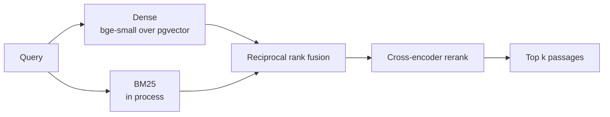
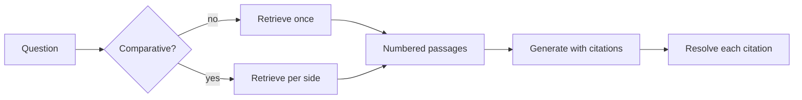

# Research Copilot

Answers questions about the quantum cryptography literature on arXiv, citing the
paragraph each claim came from. Over 25 questions, 6 of them on subjects the
corpus does not contain, it produced no fabricated citation and declined every
question it could not support.


## Corpus

The corpus is scoped to quantum key distribution and quantum cryptography rather
than to `quant-ph` as a whole. Retrieval across 185,000 papers on unrelated
subjects mostly measures topic separation, since almost any method tells an
optics paper from an error-correction one. Within one field that signal is gone
and what remains measured is passage selection, which is the operation the
system exists to perform.

Papers are read from the arXiv Atom API and ingested from their LaTeX source
rather than from the rendered PDF. A two-column preprint loses in layout exactly
what a citation needs: section headings become indistinguishable from body text,
and paragraphs fragment around displayed equations. Measured on the first three
papers, PDF extraction recovered one section per paper, the title; the LaTeX
source recovers the real hierarchy.

| | |
|---|---:|
| Papers ingested | 240 |
| Chunks | 18,969 |
| Chunks per paper | 79.0 |
| Mean chunk length | 530 characters |
| Distinct sections | 2,952 |

Of 300 papers attempted, 60 were dropped: 47 whose source the LaTeX renderer
could not process, the rest without retrievable source. That is 20% of the
query, and it is a property of the source rather than of the pipeline.

## Provenance

A citation names a paper, a paragraph and the piece within it, so that triple
carries a unique constraint in the schema. The arXiv identifier keeps its
version suffix: a revised paper is a distinct row rather than a silent
overwrite of the text a stored citation points at.

Long paragraphs are split on sentence boundaries with one sentence of overlap,
and every piece keeps the index of the paragraph it came from, so splitting
never costs the citation its anchor.

## Retrieval

Four stages, each replaceable and each measured separately.



Fusion combines ranks rather than scores. A BM25 score and a cosine similarity
live on scales that are not comparable and neither is calibrated, so weighting
them directly would require normalising a quantity with no fixed range.

BM25 is built in process from the stored chunks rather than in the database.
Postgres full text search ranks with `ts_rank`, which is not BM25, and the
evaluation below is only comparable to published numbers if the scoring
function is the one those numbers used. At corpus scale this is the component
that would move into the database first.

## Evaluation

Retrieval is measured against BEIR SciFact, whose relevance judgements make the
figures comparable to published ones, and against a hand-written question set on
the corpus itself. Generation is measured on whether its citations resolve and
whether it declines when the corpus cannot answer.

| | |
|---|---:|
| nDCG@10 on SciFact, `hybrid` | 0.709 |
| Passage found on the corpus, `hybrid+rerank` | 0.71 |
| Fabricated citations over 25 questions | 0 |
| Declined on 6 uncovered questions | 6/6 |
| Retrieval p50 | 1.6 s |
| Complete answer p50 | 9.2 s |

The numbers, how they were obtained and what they cost are in
[EVALUATION.md](EVALUATION.md).

## Answering



A comparison is not one retrieval. Asking how two protocols differ and
retrieving once returns passages about whichever side dominates the query, so
the graph fans out and retrieves for each before answering. Routing is a regular
expression rather than a model call, since the free tier meters requests and one
spent classifying is one not spent answering.

Every claim must carry a bracketed number naming the passage it came from, and
every number is resolved back to a paper, a section and a paragraph after the
answer is written. A number outside what was retrieved is reported as a
fabrication rather than rendered as a citation.

The provider holds a chain of models. A 429 means that model's daily quota is
spent, which no amount of waiting fixes, so the next model is tried immediately;
a 503 means it is briefly busy, which waiting does fix.

Repeated questions are answered from a cache keyed on embedding similarity. It
is set to a high threshold because the measurement shows the classes overlap:
within one field a pair asking different things scored 0.823 against a genuine
paraphrase at 0.733. The reasoning is in [EVALUATION.md](EVALUATION.md).

## Endpoints

| Endpoint | Purpose |
|---|---|
| `POST /search` | Retrieval only. Reaches no model and consumes no quota |
| `GET /answer` | Server-sent events: passages, then the answer, then its citations |

The passages arrive before the first token, so a reader can see what the answer
is being drawn from while it is still being written.

Generating an answer needs a key, which the caller sends in `X-Api-Key`. The
free tier allows twenty requests per model per day, so a demo answering with the
host's key would be spent by early afternoon; retrieval stays open because it
reaches no model at all. A key configured on the server is used when the header
is absent, which is the convenient arrangement for local work.

## Client

A Next.js page over the same two endpoints. Citations in the answer are controls
that reveal the passage they name, and a citation the service could not resolve
is marked rather than rendered, since a number pointing at nothing is what a
reader most needs to see.

```bash
cd web
npm install
NEXT_PUBLIC_API_URL=http://localhost:8000 npm run dev
```

The visitor's key is held in browser storage and sent only with their own
requests. It is read through `useSyncExternalStore` so the prerendered markup and
the first client render agree on an empty value.

## Running it

```bash
docker compose up -d
python -m venv venv && source venv/bin/activate
pip install -r requirements.txt

alembic upgrade head
python -m ingest.pipeline --limit 300

echo 'GOOGLE_API_KEY=your-key' > .env    # only needed to answer, not to retrieve
uvicorn api.main:app --port 8000
```

Ingestion takes roughly 50 minutes for 300 papers, most of it the three-second
delay arXiv asks between requests. A run is resumable: papers already stored are
skipped, and downloaded sources are cached on disk.

## Deployment

| Component | Host | Why |
|---|---|---|
| API | Hugging Face Spaces, Docker | The encoders, the reranker and the term index need more memory than a small free container has |
| Corpus | Neon | Postgres with `pgvector`, and the corpus is 88 MB |
| Client | Vercel | Static export of the Next.js page |

The Space is given `DATABASE_URL` and `ALLOWED_ORIGINS` as secrets. It is not
given `GOOGLE_API_KEY`: without one the service still retrieves, and generating
an answer requires the caller to supply a key, which is what keeps a public demo
from spending a single day's quota in an afternoon.

The corpus is moved rather than rebuilt. Re-ingesting means fetching three
hundred sources from arXiv again at the delay the API asks for, so the local
database is dumped and restored instead.

```bash
docker compose exec -T db pg_dump -U copilot -d copilot --no-owner > corpus.sql
psql "$NEON_URL" -f corpus.sql
```

## Development

```bash
pip install -r requirements-dev.txt

pytest              # 73 tests
ruff check .
```

No test reaches the network or the database. CI additionally applies the
migration against a `pgvector` service container, since the schema declares a
vector column that a plain Postgres image cannot create.

## Project structure

```text
Research-Copilot/
├── ingest/
│   ├── config.py         # Corpus, model and connection settings
│   ├── arxiv.py          # Atom API client
│   ├── source.py         # LaTeX source download and flattening
│   ├── extract.py        # Source to paragraphs with their section
│   ├── chunk.py          # Paragraphs to embeddable pieces
│   ├── embed.py          # Passage and query encoders
│   └── pipeline.py       # End to end ingestion
├── retrieval/
│   ├── config.py         # Candidate depth, fusion and reranking settings
│   ├── dense.py          # Nearest neighbours over pgvector
│   ├── sparse.py         # BM25 over the stored chunks
│   ├── rerank.py         # Cross-encoder rescoring
│   └── hybrid.py         # Rank fusion and the search entry point
├── generation/
│   ├── config.py         # Model, fallback chain and context size
│   ├── provider.py       # Provider interface and the Gemini backend
│   ├── prompt.py         # Numbered passages and the citation rules
│   ├── citations.py      # Resolving citations back to paragraphs
│   ├── cache.py          # Semantic cache over the daily request quota
│   └── graph.py          # Routing, retrieval and synthesis
├── api/
│   ├── main.py           # Search and the streaming answer endpoint
│   └── schemas.py        # Request and response models
├── evaluation/
│   ├── beir.py           # Benchmark loading
│   ├── metrics.py        # nDCG, recall and reciprocal rank
│   ├── benchmark.py      # Public benchmark run
│   ├── corpus.py         # Hand-written question set
│   └── generation.py     # Citations, abstention and latency
├── db/                   # SQLAlchemy models and session
├── alembic/              # Migrations
├── web/
│   ├── app/page.tsx      # Question, answer and passage panel
│   ├── components/       # Answer rendering and passage cards
│   └── lib/api.ts        # Search and the event stream reader
├── data/questions.json   # Question set for the ingested corpus
├── data/unanswerable.json # Questions the corpus cannot answer
├── EVALUATION.md         # Every measured figure and how it was obtained
├── tests/                # pytest suite, offline
└── docker-compose.yml    # Postgres with pgvector
```
